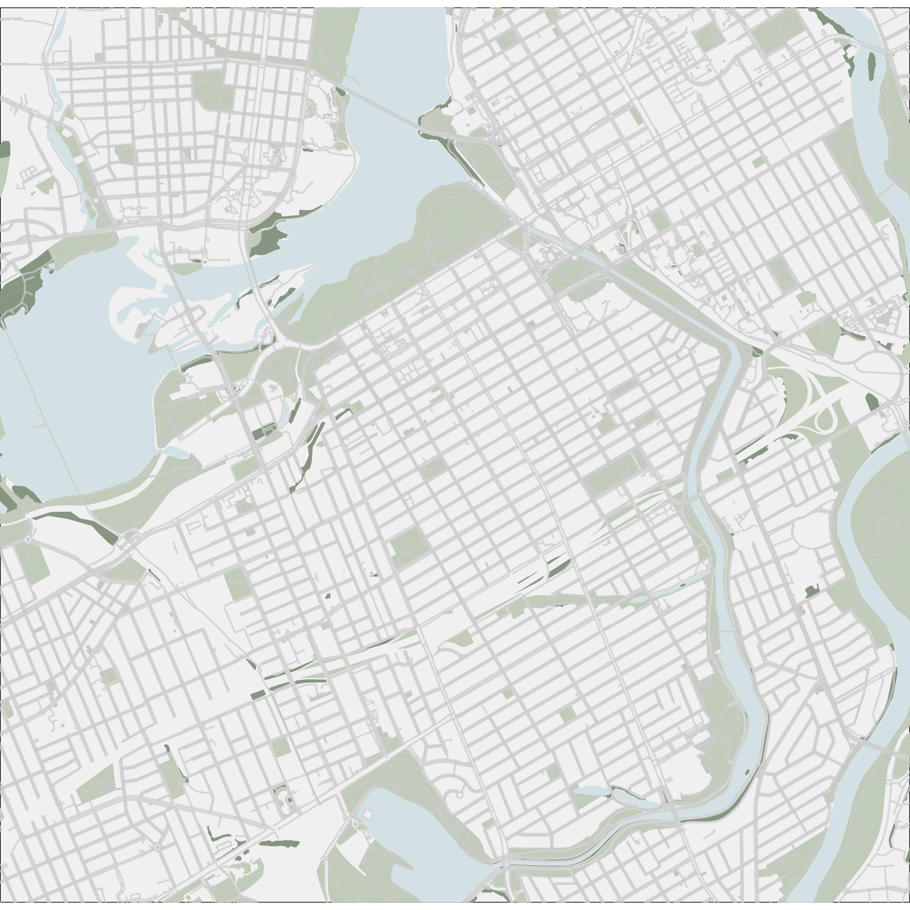
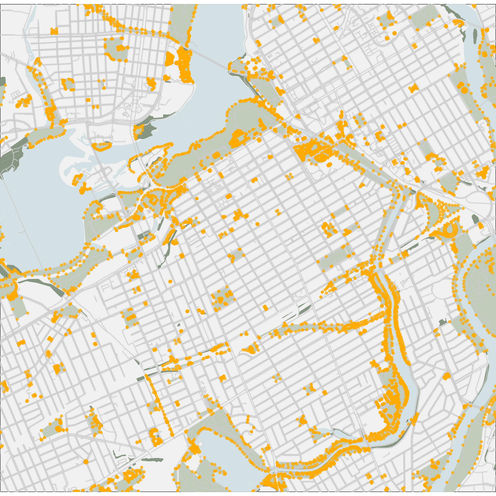
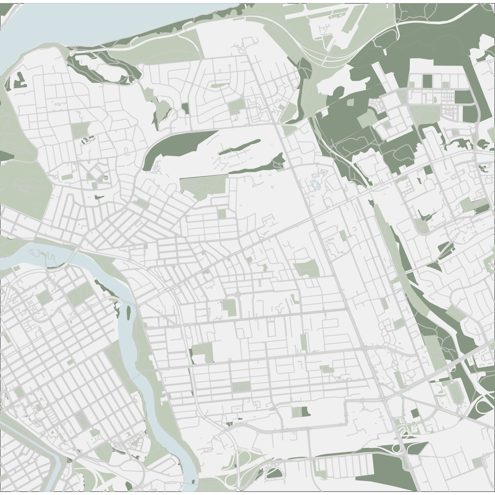
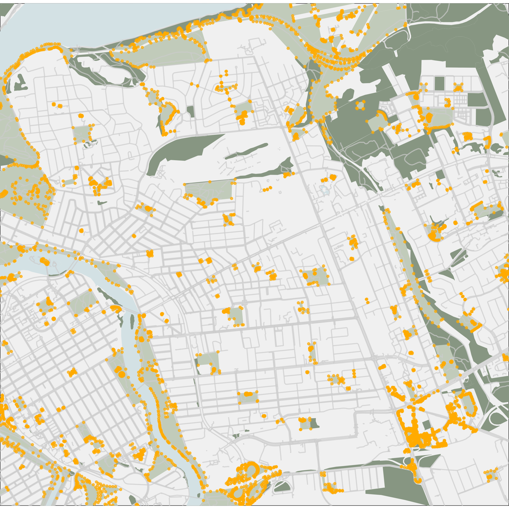
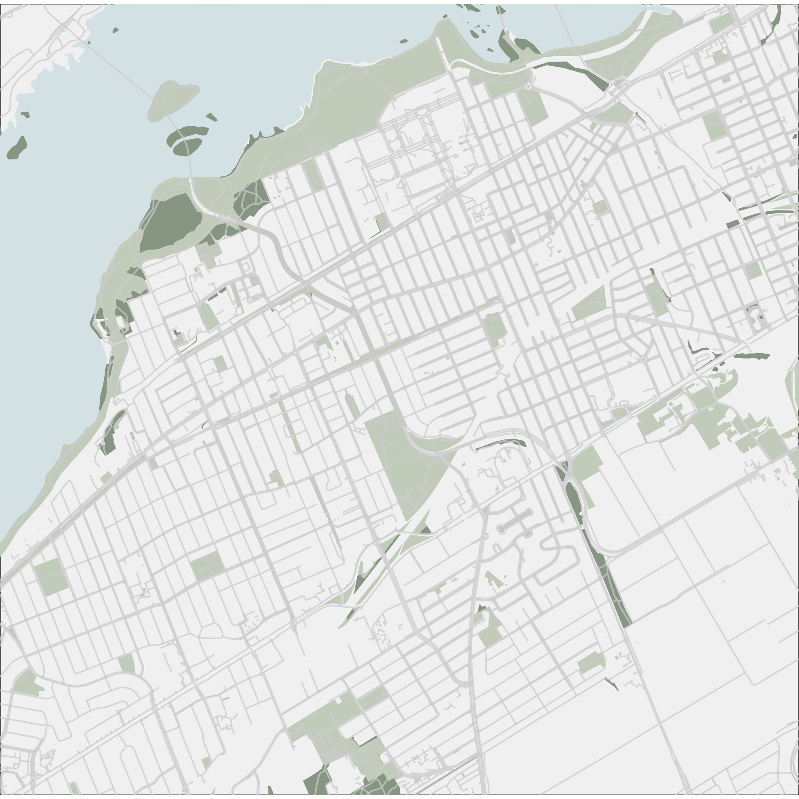
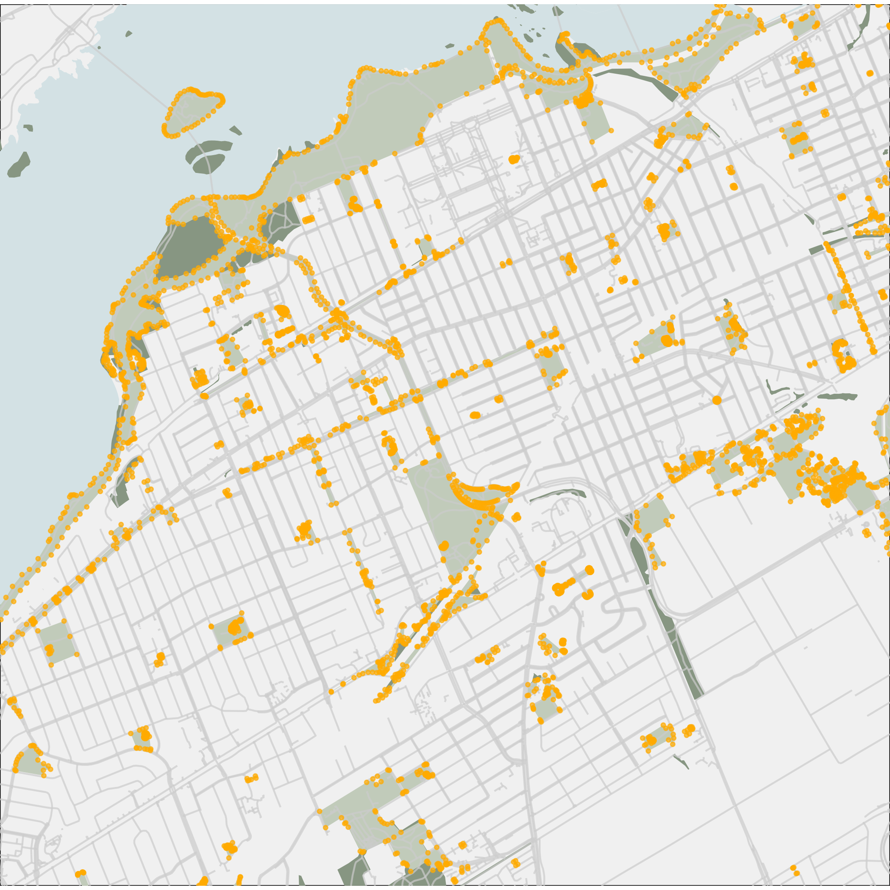
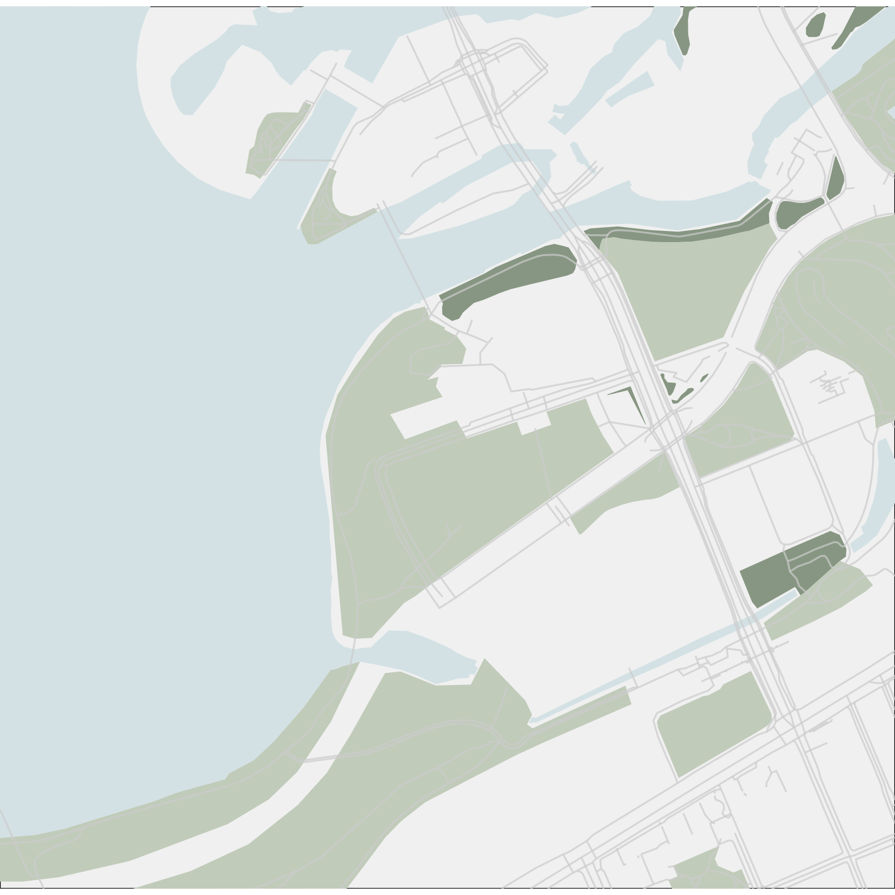
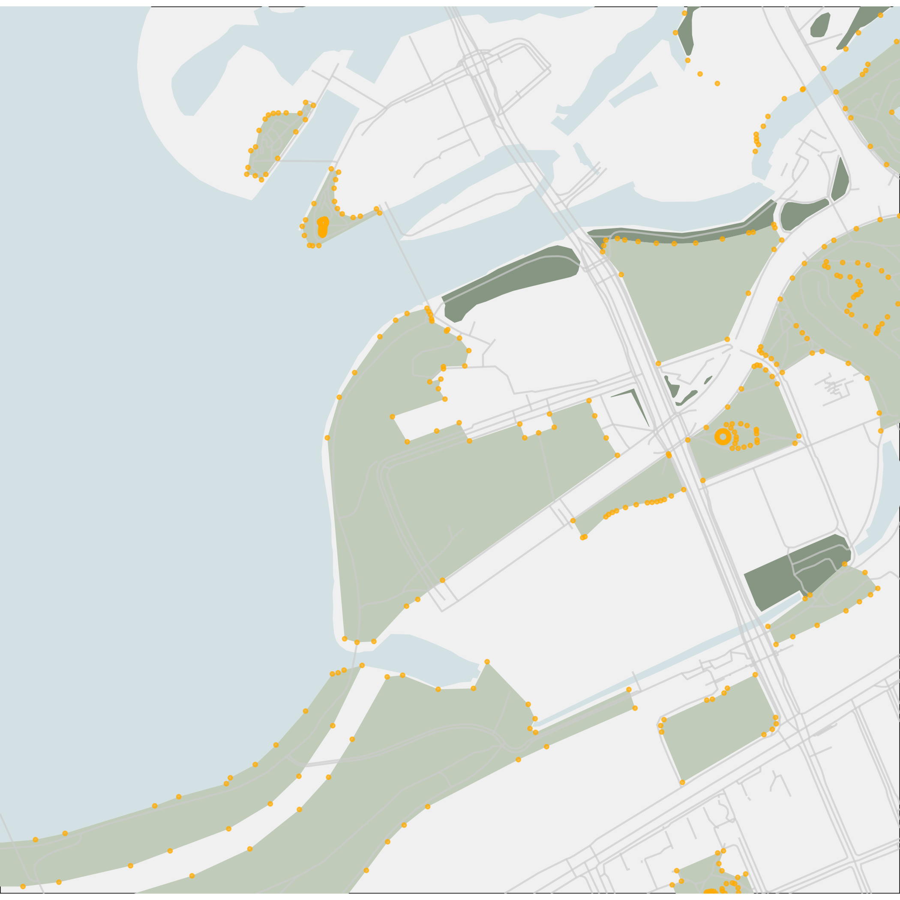
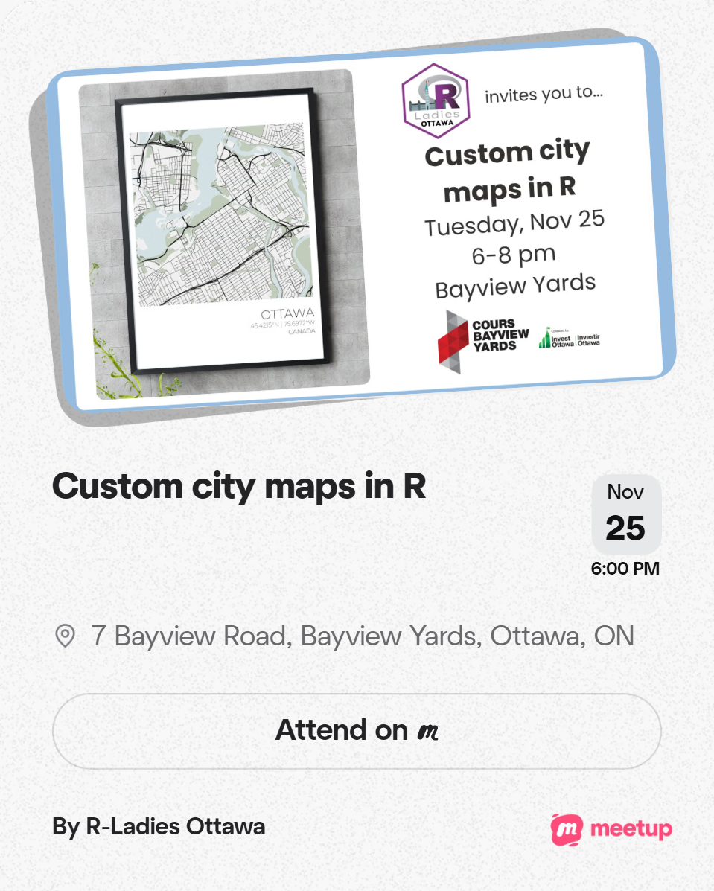
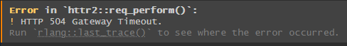

> Photo from [Adobe Stock](https://stock.adobe.com/ca).

::::{.cr-section}

:::{#cr-ok}
👀
:::

Not *clinically*, but something is up for real. [@cr-ok]{scale-by="10"}

So I've walked, biked, skedaddled around Ottawa--like most who live in the city. I've also noticed that sometimes at night, some areas aren't as well lit as others. This was only a hunch until I decided to use what we learnt from the R-Ladies Ottawa [Custom city maps in R workshop](https://www.meetup.com/rladies-ottawa/events/311779727/) and put some pen to paper. I'd made some modifications to the original template because I want to specifically look at streetlamps as an indicator that an area is lit.

:::{#cr-gtriangle_unlit}
{width=75%}
:::

:::{#cr-gtriangle_lit}
{width=75%}
:::

First, I thought I'd take a look at the Golden Triangle--which consists of Centretown, the Glebe, and Sandy Hill. This is a dense area so I'd expect to see a lot of streetlamps. @cr-gtriangle_unlit 

Which seems to be the case. @cr-gtriangle_lit

:::{#cr-east_unlit}
{width=75%}
:::

:::{#cr-east_lit}
{width=75%}
:::

So I was like OK ... maybe things are different in the East side of Ottawa? Maybe we might see some sort of disparity between Vanier and Rockliffe? @cr-east_unlit

And then I'm seeing the streetlamps and they look plentiful here too??? Am I imagining that Ottawa is not good at lighting up its streets at night??? @cr-east_lit

:::{#cr-west_unlit}
{width=75%}
:::

:::{#cr-west_lit}
{width=75%}
:::

But as a former resident of Hintonburg, I felt it in my heart that the streets could have been lit better when I was either walking or biking home at night. @cr-west_unlit

And then here again, Open Street Maps or WHOEVER is telling AND showing me that I'm wrong. The streets are lit. @cr-west_lit

But I won't go down without a fight. I know **FOR A FACT** that I hit a Personal Record (PR) at night because I was scared of the dark so I decided to look at that segment in my Strava. I remember thinking that I was out later than expected and didn't have my headlamp so I was pumping down the strip like my life depended on it. [@cr-ok]{scale-by="10"}
<br><br>
Where was this segment you ask?

:::{#cr-riverpath_unlit}
{width=75%}
:::

:::{#cr-riverpath_lit}
{width=75%}
:::

Look at this cute little scenic route. @cr-riverpath_unlit
<br><br>
Wow, much nice.

Just kidding! @cr-riverpath_lit

And what [@cr-riverpath_lit]{scale-by="1.5"}

do we [@cr-riverpath_lit]{pan-to="25px" scale-by="2"}

have here? [@cr-riverpath_lit]{pan-to="50px" scale-by="2.5"}

Look at this cute little stretch of **NOTHING**--which I love at night, by the river /s

:::{#cr-pr}
{width=75%}
:::

:::{focus-on="cr-pr"}

Anyways, here's my PR for that segment. 
<br><br>
For a mostly casual, bike-to-get-around-the-city kind of person, it's not too shabby. However, I don't want to be hitting my PRs out of fear. I want to be hitting them because I want to, on my own terms. 
<br><br>
So Ottawa/National Capital Commission, put more lights around when people be walking/biking/getting around.

:::

EDIT: I drove along the Kichi Zibi Mikan recently and noticed there weren't any lights PERIOD so ... [@cr-ok]{scale-by="10"}

## The code behind it all

:::{#cr-event}
{width=75%}
:::

Like I mentioned earlier, I took the code used from our [Custom city maps in R workshop](https://www.meetup.com/rladies-ottawa/events/311779727/). @cr-event
<br><br>
For this project, I was interested specifically in lit areas and to find the appropriate keys I used the [wiki](https://wiki.openstreetmap.org/wiki/Map_features). I was debating between using lit or highway: streetlamp but I ended up using the latter because lit only looks at street lighting and I was more interested in lighting for pedestrian or bike paths. You can find the full code [here](). It's essentially broken up into 2 parts:
<br><br>
1. The function
<br>
2. Setting the parameters for the outputs
<br><br>
This might come from my *Python influence* 🐍 but it's set up similar to your functions and `main.py`. 

:::{#cr-mapcode1}
```{r}
street_lamps <- query |>
    add_osm_feature(
      key = "highway",
      value = "street_lamp") |>
    osmdata_sf()

street_lamps_cropped <- st_crop(rec$osm_points, bbox_sf)

street_lamp_colour <- "#ffab00"
```
:::

The code starts by asking you to enter the parameters for OpenStreetMap to know what area you want to focus in on. Next, you have to tell it what attributes you want. For the most part I wanted to show the the basic infracture of the city. @cr-mapcode1

This is a section I added to add a layer of street lamps on top of the map. [@cr-mapcode1]{highlight="3,4"}

We see from the wiki that this is a node so we use `osm_points` instead of `osm_multipolygons`, `osm_polygons`, or `osm_lines` which were used for water, vegetation, or roads resepectively. [@cr-mapcode1]{highlight="7"}

And we assign a nice yellow to indicate street lamp locations. [@cr-mapcode1]{highlight="9"}

:::{#cr-mapcode2}
```{r}
plt <- ggplot() +
    # rivers
    geom_sf(data = water_a_cropped,
            fill = water_colour,
            colour = NA) +
    # other bodies of water
    geom_sf(data = water_b_cropped,
            fill = water_colour,
            colour = NA) +
    # natural vegetation
    geom_sf(data = natural_cropped,
            fill = natural_colour,
            colour = NA) +
    # recreational spaces
    geom_sf(data = rec_cropped,
            fill = rec_colour,
            colour = NA) +
    # minor roads
    geom_sf(
      data = roads_b_cropped,
      colour = roads_b_colour,
      size = 0.5,
      alpha = 0.7
    ) +
    coord_sf(expand = FALSE) + # remove margins
    theme_void() + # remove gridlines, etc.
    theme(panel.background = element_rect(fill = bkgd_colour))
  
ggsave(filename_lamp_false)
  
plt <- plt +
    # street lamps
    geom_sf(
      data = street_lamps_cropped,
      colour = street_lamp_colour,
      size = 0.8,
      alpha = 0.7
    )

ggsave(filename_lamp_true)
```
:::

Further down the code, the next big modification I made was to output 2 maps. The first being the unlit version of my map. [@cr-mapcode2]{highlight="1-27"}

Then, we export this map. [@cr-mapcode2]{highlight="29"}

After this, I overlay the streetlamps on top of this map. [@cr-mapcode2]{highlight="31-38"}

And then we export this map. [@cr-mapcode2]{highlight="40"}

:::{#cr-mapoutput}
```{r}
source('./map_function_lights.R')

# For loop ----
for (x in c('centretown', 'west', 'east', 'riverpath')) {
  
  filepath_start = paste0('./outputs/', format(Sys.Date(), "%Y"), '_')
  filepath_end = '-map.png'
  
  if (x == 'centretown') { # Golden Triangle
    query_params = c(-75.66851, 45.39212, -75.73073, 45.43508)
  } else if (x == 'west') { # Hintonburg & Westboro
    query_params = c(-75.76953, 45.41400, -75.70799, 45.37120)
  } else if (x == 'east') { # Vanier & Rockcliffe
    query_params = c(-75.68816, 45.46103, -75.62259, 45.41562)
  } else if (x == 'riverpath') { # Ottawa River Pathway
    query_params = c(-75.72552, 45.42114, -75.71101, 45.41110)
  } else {
    NULL
  }
  
  make_map(
    query_params,
    paste0(filepath_start, 'unlit_', x, filepath_end),
    paste0(filepath_start, 'lit_', x, filepath_end)
  )
  
}
```
:::

Here is the code for the map outputs. @cr-mapoutput

The first step is that it calls the function we talked about earlier. [@cr-mapoutput]{highlight="1"}

I have the list I want to re-iterate over. [@cr-mapoutput]{highlight="4"}

Then, because we essentially want to do the same thing 4 times, I've made this into a loop. [@cr-mapoutput]{highlight="5-19"}

Each section of the city has different query parameters but most of the code if repeated with minor differences.[@cr-mapoutput]{highlight="21-25"}

:::{#cr-error}

:::

:::{focus-on="cr-error"}

In the full code, you'll see the for loop broken down though and that's because I kept getting this annoying AF error. Due to this, I was getting impatient and running just chunks of the code even though what you see above is what I imagine an ideal look of the what the code should be doing.
<br><br>
BUT WHATEVER.

:::

:::{#cr-error}

:::

## Next steps

I've got some Strava data to look at and compare all the times I've gone through this segment but that will take some time to parse through the data because geospatial data is fairly new to me. [@cr-ok]{scale-by="10"}

:::{#cr-heart}
❤️🔥
:::

Thanks for listening to my Ted Talk! [@cr-heart]{scale-by="10"}

:::
