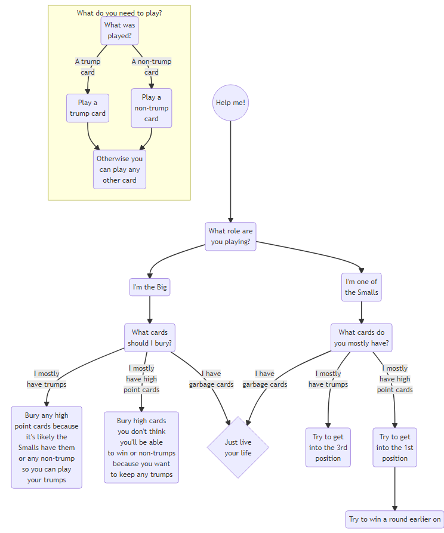

# Zole

::: {.callout-note collapse="true"}

## Legend

I'll be using the following shorthand in this document:

|       |   |
|-------|---|
| 1/Ace | A |
| King  | K |
| Queen | Q |
| Jack  | J |

:::

## What is zole?

This is a 3-player[^1] Latvian **trick-taking** card game. The official rules and terminology were published by the Latvian Zole Game Federation in 1996.

[^1]: You can play this game with up to 5 people but if you have more than 3 players then the remaining players have sit out for a round.

<!-- ## History -->

## The Goal

You or your team want to win the most amount of points. You can find the values listed [here](#values-of-cards)

If you're the Big you want to win 61+ points and if you're the Small team you want to win 60+ points. The total amount of winnable points is 120. Find out more information about roles of the Big and the Smalls [here](#roles).

## Set-up

This game requires a normal playing deck minus several cards. The deck consists of all of the A, K, Q, J, tens, and nines, plus the 8 and 7 of diamonds; therefore, **26** cards are used for this game. 

### Dealing

Deal out 8 cards to each player with 2 cards in the middle, faced down.

::: {.callout-important}
Since there are so few cards, shuffling is very important to avoid cards sticking together. Once the cards are shuffled, the **player on the right needs to cut the deck**. Additionally, when counting points at the end, try to avoid grouping similar cards together as this might also stick cards together.
:::

You have the dealer, the first person left of the dealer (Player 1 or P1), and the player right of the dealer (Player 2 or P2).

You deal clockwise in the following order:

1. 4 to P1, 4 to P2 & 4 to the dealer
2. Deal 2 to the centre
3. 2 to P1, 42 to P2 & 2 to the dealer
4. 2 to P1, 42 to P2 & 2 to the dealer

Now that the cards are dealt, the roles have to be determined. Dealing is done clockwise; therefore, the dealer for the next game is left of the previous dealer.

## How to play

### Roles

You can play one of two roles:

- Big
- Small

The Smalls team up together against the Big (i.e., 2 vs. 1).

Ideally, if you think you can win on your own you take the role of the Big; otherwise you take the role of one of the two Smalls.

::: {.callout-tip collapse="true"}
## Fun fact

The pile in the middle is referred to as the **lielais**.
:::

Starting to the left of the dealer, P1 will decide if they will take on the role of Big. If they decline then it goes to P2 and if P2 declines it goes to the dealer. 

Once someone decides to be the Big then the roles are determined for that round. A player signals that they have decided to be the Big if they collect the 2 cards in the centre. This player starts the game by adding 2 cards from their hand into their points pile, facedown.

After the big has placed their 2 cards facedown, the **player to the left of the dealer starts the first round**.

::: {.callout-note collapse="true"}

## What if no one chooses to be the Big?

This variant is called **Reverse Zole**.

The rules change and instead of wanting the most points, you want to win the least amount of hands, as the player with the least amount of hands wins. In this variant, all players are playing independently--meaning there are no teams in this round. The first 2 rounds will include the middle cards. As per usual, the player left of the dealer will start. Once all the cards in this round have been played, you can check which player has the winning card. Flip one of the cards from the middle pile. If this beats the highest card, then that pile is put off to the side and no one takes the round. If the winning player still has the highest card that round goes into their pile. You can think of this as the first 2 rounds have a wild card to potentially save the winning player from taking the round.

When you win a pile you want to group the cards into separate piles for each round so other players can see how many rounds you've won. The game finishes when all the cards have been played. The player with the most amount of rounds won loses this round. 

If there is a tie of the number of rounds, the tiebreaker is determined by the values of the points of the cards won.

:::

### Playing

Like most trick-taking games, the play is determined by the first action. Therefore, if the first player puts down a trump then all players must follow suit, unless they are unable and in which case they can play any card. Whoever wins the trick gets to start off the next one and so on and so forth until all cards are played. If you win a trick then you get to collect those cards that were played. 

::: {.callout-important}
You can only look back at the last 3 cards. This means you'll have to remember what cards where played!
:::

The Big has their own points and the Smalls pool their points together. Once all cards have been played then you collect and count your points.

### Flowchart

::: {.column-body}

:::

### Things to consider

::: {.panel-tabset}

#### Playing the Big

You typically take this role if you feel like you can win against the other 2 players. You'll probably want to take this role if you have the higher trumps.

When you're the Big, you know what cards are shared by the other two. If you watch how they play you can guess who might have the higher scoring cards or who might have the trumps between the two of them. While, the 2 Smalls don't know what cards the other has--and there is no table-talking between them during the game. Let's imagine you're the third and last player to decide to take the middle pile. In this scenario, you have a little more than half the trumps. If the other two quickly decided they didn't want the pile, it may be because they don't have strong cards or trumps. You can deduce that it the remaining is equally split between the 2. If this is the case you may decide to start with (low) trumps to flush out the trumps in their hands. Even if they start with a non-trump and you only have trumps you would still win the hands despite the round not starting with a trump. Though it may not be a great play to start with trumps as a Small, it could be a strategy as a Big.

When burying cards, it's best to secure higher-scoring cards. However, it is noteworthy that the A[♦]{style="color:red;"} is a high-scoring card but it's also a trump. So it may be worth holding onto it and using it to trump and score within the game--but this is a gamble!

#### Playing the Smalls

Ideally, you want to sandwich the Big. This is so one player can set the stage, the Big plays, and the second Small can react. For example, the first Small could play a high-scoring card, force the Big to try to take it and the Second Small can gauge whether they can take it or not.

There are ways that you can signal to your partner what kind of cards you have which would not be considered as table talk. E.g., if you keep playing trump it might signal that you should be the anchor and may have the better chance to beat the Big if the first Small plays a high-scoring card.

When first starting, it **may** not be a good idea to play a trump. This is moreso true for a Small because it then forces all players to follow suit and your partner may want to keep their trump for a future round.

:::

## Ending the game

The game is concluded when all cards have been played. If you are playing standard zole, you or you and your teammate need to **score at least 61 points to win**. If it's a tie, then the win goes to the Big. If you're playing reverse then you or you and your teammate want to score less than 60.

## Tips

- Remember that Q♣ is the **strongest card** and 7[♦]{style="color:red;"} is the **weakest trump card**.
- It might make it easier to learn and remember the cards if you separate the trumps from non-trumps in your hand.
- If you think you're going to lose the round, you might as well dump a low scoring card--if possible. This works the other way for Reverse Zole, where if you see another player play a high card it would be good to sneak your highest card so that you're not at risk in future rounds.

<!-- If playing multiple games, points are allocated x. -->

<!-- Additionally, if there is a difference of 30 points because the winner party and the losing party then x. -->

## Variants

### Playing with 2 people

This version is called **Student Zole**.

In this variant, the layout is different. Below are the steps to set up:

1. P1 shuffles
2. P2 cuts the deck
3. (P1 deals 2 cards to P2 then 2 cards to themself) * 2
4. (P1 places 1 face down card in front of P2, then themself) * 4
    1. Until there are 2 rows of 4 face down cards (total of 8)
5. (P1 places 1 face up card in front of P2 on top of the face down card, then themself) * 4
    1. Until there are 2 rows of 4 face up cards (total of 8)
6. Deal 1 card to P1 and the last card to P2

Here's a visualization:

::: {.panel-tabset}

#### Step 3.1

P2: 🃏🃏
P1: 🃏🃏

#### Step 3.2

P2: 🃏🃏 + 🃏🃏
P1: 🃏🃏 + 🃏🃏

#### Step 4.1

P2: 🃏🃏🃏🃏

    🃏 (face down)
    🃏 (face down)

P1: 🃏🃏🃏🃏

#### Step 4.2

P2: 🃏🃏🃏🃏

    🃏🃏🃏🃏 (face down)
    🃏🃏🃏🃏 (face down)
    
P1: 🃏🃏🃏🃏

#### Step 5.1

P2: 🃏🃏🃏🃏

    🃏 (face up)
    🃏🃏🃏🃏 
    🃏🃏🃏🃏
    🃏 (face up)
    
P1: 🃏🃏🃏🃏

#### Step 5.2

P2: 🃏🃏🃏🃏

    🃏🃏🃏🃏 (face up)
    🃏🃏🃏🃏 
    🃏🃏🃏🃏
    🃏🃏🃏🃏 (face up)
    
P1: 🃏🃏🃏🃏

#### Step 6

P2: 🃏🃏🃏🃏 + 🃏

    🃏🃏🃏🃏 (face up)
    🃏🃏🃏🃏 
    🃏🃏🃏🃏
    🃏🃏🃏🃏 (face up)
    
P1: 🃏🃏🃏🃏 + 🃏 (last card)

:::

Each player will have 5 cards in their hand that is only visible to them. Both players have 4 face up cards each that are visible to the both players and both players will have 4 face down cards each that are not visible to both players until they are revealed. With this variation you can plan for the cards that are visible but there is still some chance for the cards that are hidden.

P2 starts, as per usual that the person who cuts the deck begins the game. They can play a card from their hand or they can play one of their face up cards. If you play a face up card, you can reveal the card underneath once the round has been resolved. Additionally, you cannot move a face up card over to be able to flip a face down card.

The rules, otherwise for playing are the same.

### Playing with 4 people

The extra player deals (and bartends) in rotation.

## Fun phrases

::: {.callout-caution}
This section is a work in progress!
:::

| Latvian                     | English                               | Meaning                                            |
|-----------------------------|---------------------------------------|----------------------------------------------------|
| Trumps prasi, trumps jāliek | Trump is called, trump has to be laid | If a trump is played then it must be followed suit |
| Sviesta maizīte             | Buttered bread                        | Cashing in a lot of points                         |

## Reference

::: {.panel-tabset}

### English

::: {.panel-tabset}

#### Values of cards

| Card | Value |
|------|-------|
| A    | 11    |
| 10   | 10    |
| K    | 4     |
| Q    | 3     |
| J    | 2     |
| <=9  | 0     |

#### Trump cards

Below is a list of the trumps cards, ranked in order of strength:

| #  | Card                      |
|----|---------------------------|
| 1  | Q♣                        |
| 2  | Q♠                        |
| 3  | Q[♥]{style="color:red;"}  |
| 4  | Q[♦]{style="color:red;"}  |
| 5  | J♣                        |
| 6  | J♠                        |
| 7  | J[♥]{style="color:red;"}  |
| 8  | J[♦]{style="color:red;"}  |
| 9  | A[♦]{style="color:red;"}  |
| 10 | 10[♦]{style="color:red;"} |
| 11 | K[♦]{style="color:red;"}  |
| 12 | 9[♦]{style="color:red;"}  |
| 13 | 8[♦]{style="color:red;"}  |
| 14 | 7[♦]{style="color:red;"}  |

::: {.callout-important}
This order isn't a commonly seen order; note that the K is lower than the 10!
:::

All other cards are non-trump.

#### Non-trump cards

Below are the non-trump cards, ranked in order of strength:

| # | Card |
|---|------|
| 1 | A    |
| 2 | 10   |
| 3 | K    |
| 4 | 9    |
| 5 | 8    |
| 6 | 7    |

::: {.callout-note}
This applies to all clubs, all spades, and all hearts (minus Q & J).
:::

:::

### Latvian

::: {.panel-tabset}

#### Values of cards

| Card | Value |
|------|-------|
| 1    | 11    |
| 10   | 10    |
| K    | 4     |
| D    | 3     |
| S    | 2     |
| <=9  | 0     |

#### Trump cards

Below is a list of the trumps cards, ranked in order of strength:

| #  | Card                      |
|----|---------------------------|
| 1  | D♣                        |
| 2  | D♠                        |
| 3  | D[♥]{style="color:red;"}  |
| 4  | D[♦]{style="color:red;"}  |
| 5  | S♣                        |
| 6  | S♠                        |
| 7  | S[♥]{style="color:red;"}  |
| 8  | S[♦]{style="color:red;"}  |
| 9  | 1[♦]{style="color:red;"}  |
| 10 | 10[♦]{style="color:red;"} |
| 11 | K[♦]{style="color:red;"}  |
| 12 | 9[♦]{style="color:red;"}  |
| 13 | 8[♦]{style="color:red;"}  |
| 14 | 7[♦]{style="color:red;"}  |

::: {.callout-important}
This order isn't a commonly seen order; note that the K is lower than the 10!
:::

All other cards are non-trump.

#### Non-trump cards

Below are the non-trump cards, ranked in order of strength:

| # | Card |
|---|------|
| 1 | 1    |
| 2 | 10   |
| 3 | K    |
| 4 | 9    |
| 5 | 8    |
| 6 | 7    |

::: {.callout-note}
This applies to all clubs, all spades, and all hearts (minus Q & J).
:::

:::

:::
